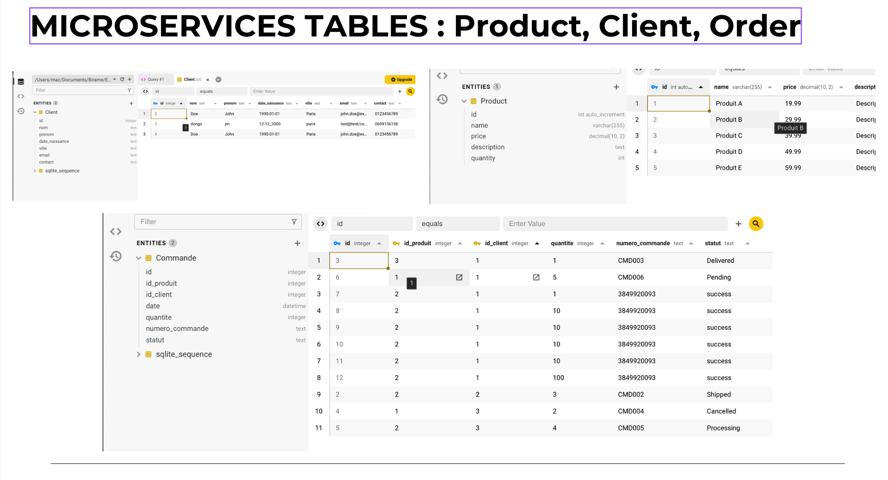
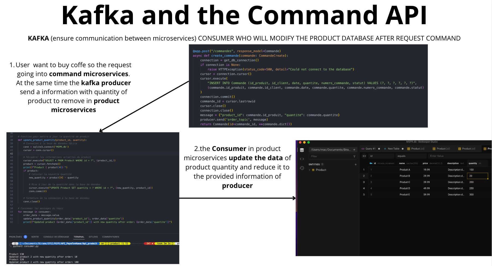
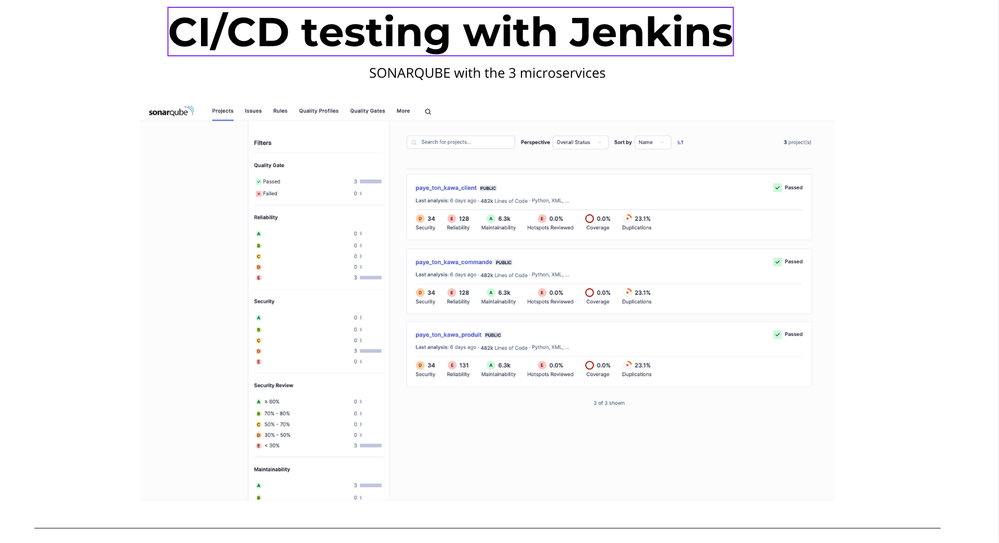
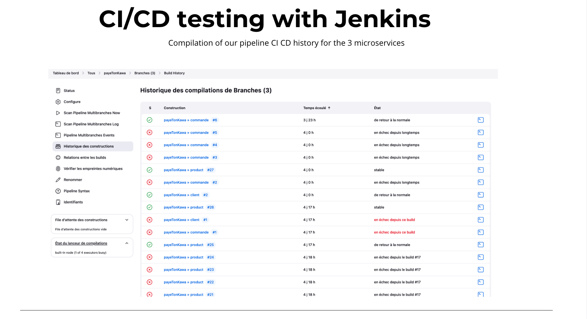
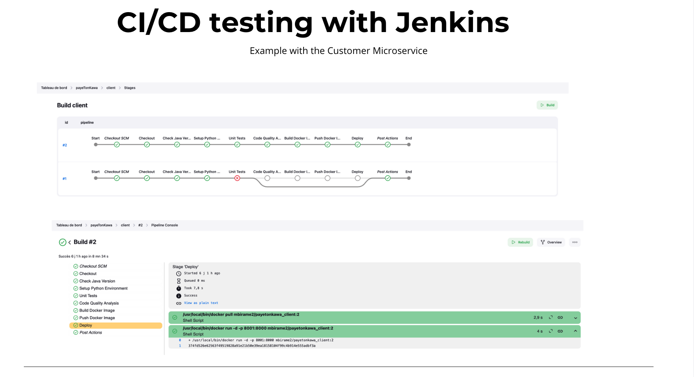

# PayetonKawa

PayetonKawa is a microservices-based web application for selling coffee online. It is designed using modern DevOps and development practices, including containerization, continuous integration/deployment, and API-driven architecture. This project was developed as part of a professional certification program focused on IT systems and data-driven application management.

## 📦 Project Overview

The objective is to build a robust, scalable, and secure e-commerce platform for coffee sales using microservices. Each service manages a separate domain (Clients, Products, Orders) with its own database and API.

---

## 🚀 Technologies Used

- **FastAPI** – for building high-performance APIs
- **SQLite** – lightweight, serverless database for each microservice
- **Docker** – containerization for consistent deployment environments
- **Jenkins & GitLab CI/CD** – automation of testing, building, and deployment
- **JWT + OAuth2** – secure authentication and authorization

---

## 🗃️ Database Structure

Each service has its own SQLite database:

### Clients
| Field           | Type     |
|----------------|----------|
| id             | INTEGER (PK, AUTOINCREMENT) |
| nom            | TEXT     |
| prenom         | TEXT     |
| date_naissance | TEXT     |
| ville          | TEXT     |
| email          | TEXT     |
| contact        | TEXT     |

### Products
| Field       | Type     |
|------------|----------|
| id         | INTEGER (PK, AUTOINCREMENT) |
| nom        | TEXT     |
| description| TEXT     |
| prix       | REAL     |
| stock      | INTEGER  |

### Orders
| Field         | Type     |
|--------------|----------|
| id           | INTEGER (PK, AUTOINCREMENT) |
| client_id    | INTEGER (FK) |
| produit_id   | INTEGER (FK) |
| quantite     | INTEGER  |
| date_commande| TEXT     |
| status       | TEXT     |

---

## 📡 API Endpoints

### Clients
- `GET /clients`
- `GET /clients/{client_id}`
- `POST /clients`
- `PUT /clients/{client_id}`
- `DELETE /clients/{client_id}`

### Products
- `GET /products`
- `GET /products/{product_id}`
- `POST /products`
- `PUT /products/{product_id}`
- `DELETE /products/{product_id}`

### Orders
- `GET /orders`
- `GET /orders/{order_id}`
- `POST /orders`
- `PUT /orders/{order_id}`
- `DELETE /orders/{order_id}`

---

## 🔒 Security

- JWT-based authentication
- OAuth2 for token handling
- Protected endpoints with token validation
- CORS middleware for request control
- Passwords hashed and securely stored

---

## 🧪 Testing

- **Frameworks:** Pytest & FastAPI’s TestClient
- **Tests:**
  - Unit tests for endpoints
  - Integration tests for service interactions
  - Validation using Pydantic models

---

## 🛠️ DevOps & CI/CD

### Docker

Each microservice is packaged into its own Docker container for isolated, scalable deployment.

### Jenkins CI/CD Pipeline

- Multibranch pipeline project
- Automated build, test, code quality analysis (SonarQube), Docker image creation & push
- Docker image deployment on production server

### GitLab Integration

CI jobs triggered via repository changes with Jenkins handling the full CI/CD workflow.

---

## 🔐 Authentication Flow

1. **Login** via `/token` endpoint.
2. Receive a **JWT** token.
3. Use the token in the `Authorization` header for protected routes.

---

## 📈 Project Highlights

- Fully containerized architecture
- CI/CD from development to deployment
- Clear separation of concerns with microservices
- Secure and validated APIs
- Efficient use of lightweight tools (SQLite + FastAPI)

---

## 📚 Future Improvements

- Switch to PostgreSQL or another RDBMS for scalability
- Frontend integration
- Role-based access control (RBAC)
- Advanced monitoring and logging

---

## 📚 Images

- 
- 
- 
- 
- 
---

## 📄 License

Birame MBOUP
